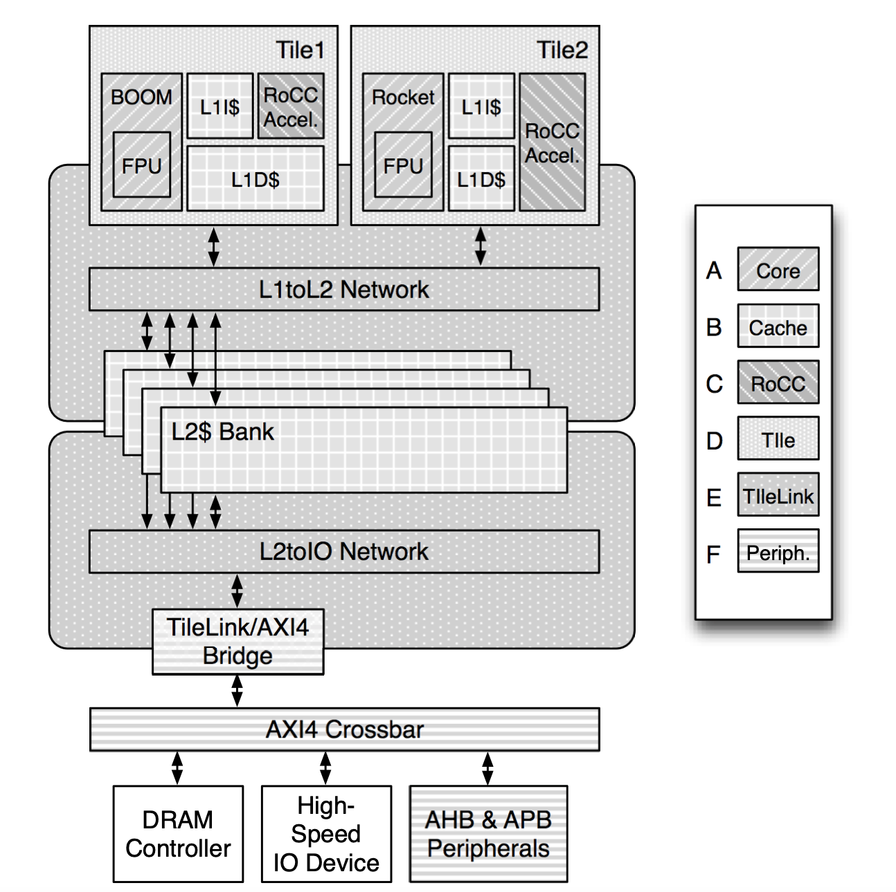

# RocketChip Cache Information

## L1D Cache

Looks like they use the HellaCache whose parameters can be found [here](https://github.com/chipsalliance/rocket-chip/blob/master/src/main/scala/rocket/HellaCache.scala).

``` scala
class DCacheDataArray(implicit p: Parameters) extends L1HellaCacheModule()(p) {
  val io = IO(new Bundle {
    val req = Flipped(Valid(new DCacheDataReq))
    val resp = Output(Vec(nWays, UInt((req.bits.wdata.getWidth).W)))
  })

  require(rowBits % subWordBits == 0, "rowBits must be a multiple of subWordBits")
  val eccMask = if (eccBits == subWordBits) Seq(true.B) else io.req.bits.eccMask.asBools
  val wMask = if (nWays == 1) eccMask else (0 until nWays).flatMap(i => eccMask.map(_ && io.req.bits.way_en(i)))
  val wWords = io.req.bits.wdata.grouped(encBits * (subWordBits / eccBits))
  val addr = io.req.bits.addr >> rowOffBits
  val data_arrays = Seq.tabulate(rowBits / subWordBits) {
    i =>
      DescribedSRAM(
        name = s"data_arrays_${i}",
        desc = "DCache Data Array",
        size = nSets * cacheBlockBytes / rowBytes,
        data = Vec(nWays * (subWordBits / eccBits), UInt(encBits.W))
      )
  }

  val rdata = for ((array , i) <- data_arrays.zipWithIndex) yield {
    val valid = io.req.valid && ((data_arrays.size == 1).B || io.req.bits.wordMask(i))
    when (valid && io.req.bits.write) {
      val wMaskSlice = (0 until wMask.size).filter(j => i % (wordBits/subWordBits) == (j % (wordBytes/eccBytes)) / (subWordBytes/eccBytes)).map(wMask(_))
      val wData = wWords(i).grouped(encBits)
      array.write(addr, VecInit((0 until nWays).flatMap(i => wData)), wMaskSlice)
    }
    val data = array.read(addr, valid && !io.req.bits.write)
    data.grouped(subWordBits / eccBits).map(_.asUInt).toSeq
  }
  (io.resp zip rdata.transpose).foreach { case (resp, data) => resp := data.asUInt }
}
```

Above is the code for the [L1D Cache](https://github.com/chipsalliance/rocket-chip/blob/master/src/main/scala/rocket/DCache.scala).

Parameters class are defined [here](https://github.com/chipsalliance/cde/blob/384c06b8d45c8184ca2f3fba2f8e78f79d2c1b51/cde/src/chipsalliance/rocketchip/config.scala).

It seems like the size can be adjusted by DCacheParams found [here](https://github.com/chipsalliance/rocket-chip/blob/836be7a92e5bd368a8a49f408a44b71c738a9a68/src/main/scala/rocket/HellaCache.scala#L17C1-L57C1). It is the same as this:

``` scala
case class DCacheParams(
    nSets: Int = 64,
    nWays: Int = 4,
    rowBits: Int = 64,
    subWordBits: Option[Int] = None,
    replacementPolicy: String = "random",
    nTLBSets: Int = 1,
    nTLBWays: Int = 32,
    nTLBBasePageSectors: Int = 4,
    nTLBSuperpages: Int = 4,
    tagECC: Option[String] = None,
    dataECC: Option[String] = None,
    dataECCBytes: Int = 1,
    nMSHRs: Int = 1,
    nSDQ: Int = 17,
    nRPQ: Int = 16,
    nMMIOs: Int = 1,
    blockBytes: Int = 64,
    separateUncachedResp: Boolean = false,
    acquireBeforeRelease: Boolean = false,
    pipelineWayMux: Boolean = false,
    clockGate: Boolean = false,
    scratch: Option[BigInt] = None) extends L1CacheParams {

  def tagCode: Code = Code.fromString(tagECC)
  def dataCode: Code = Code.fromString(dataECC)

  def dataScratchpadBytes: Int = scratch.map(_ => nSets*blockBytes).getOrElse(0)

  def replacement = new RandomReplacement(nWays)

  def silentDrop: Boolean = !acquireBeforeRelease

  require((!scratch.isDefined || nWays == 1),
    "Scratchpad only allowed in direct-mapped cache.")
  require((!scratch.isDefined || nMSHRs == 0),
    "Scratchpad only allowed in blocking cache.")
  if (scratch.isEmpty)
    require(isPow2(nSets), s"nSets($nSets) must be pow2")
}
```

So, a translation into gem5 would be:

``` python
L1DCache(size='16KiB', assoc=4, mshrs=1, tgts_per_mshr=16)
# DTLB Page walk caches
self.dptw_caches = [
    MMUCache(size="2KiB")
    for _ in range(board.get_processor().get_num_cores())
]
```

We would need to _finetune_ `tag_latency`, `data_latency` and `response_latency`, and the other parameters of the `MMUCache`.

## L1I Cache

Source: [https://github.com/chipsalliance/rocket-chip/blob/master/src/main/scala/rocket/ICache.scala](https://github.com/chipsalliance/rocket-chip/blob/master/src/main/scala/rocket/ICache.scala)

Here are the parameters of interest:

``` scala
case class ICacheParams(
    nSets: Int = 64,
    nWays: Int = 4,
    rowBits: Int = 128,
    nTLBSets: Int = 1,
    nTLBWays: Int = 32,
    nTLBBasePageSectors: Int = 4,
    nTLBSuperpages: Int = 4,
    cacheIdBits: Int = 0,
    tagECC: Option[String] = None,
    dataECC: Option[String] = None,
    itimAddr: Option[BigInt] = None,
    prefetch: Boolean = false,
    blockBytes: Int = 64,
    latency: Int = 2,
    fetchBytes: Int = 4) extends L1CacheParams {
  def tagCode: Code = Code.fromString(tagECC)
  def dataCode: Code = Code.fromString(dataECC)
  def replacement = new RandomReplacement(nWays)
}
```

So, a translation into gem5 would be:

``` python
L1ICache(size='16KiB', assoc=4)
# ITLB Page walk caches
self.iptw_caches = [
    MMUCache(size="2KiB")
    for _ in range(board.get_processor().get_num_cores())
]
```

We do not have information about `mshrs`, `tgts_per_mshr`.

Some latency in the cache is 2 cycles: is it `tag_latency`, `response_latency` or `data_latency`?

Also, Prefetcher of the L1I Cache should be set to `None`.

We need to _finetune_ `tag_latency`, `response_latency`, `data_latency`, `mshrs`, `tgts_per_mshr`, and the other parameters of the `MMUCache`.

## L2 Cache

The 4 banked L2 Cache does exist, but I haven't been able to find any specifications on it in the rocket-chip repository.

It could be housed [here](https://github.com/sifive/block-inclusivecache-sifive/blob/master/design/craft/inclusivecache/src/Configs.scala)(?) and this was linked in this [issue](https://github.com/chipsalliance/rocket-chip/issues/653) and this [issue](https://github.com/chipsalliance/rocket-chip/issues/2557) in the rocket-chip repository, and I think they auto connect it to Rocket. I also saw this information [here](https://chipyard.readthedocs.io/en/latest/Customization/Memory-Hierarchy.html#the-sifive-l2-cache). If we go by this, it would be a `512 KiB 8-way cache`.

Every parameter in this cache would need to be _finetuned_.

## Cache Hierarchy

Private L1 Shared L2 Cache Hierarchy, as can be seen in this diagram:

